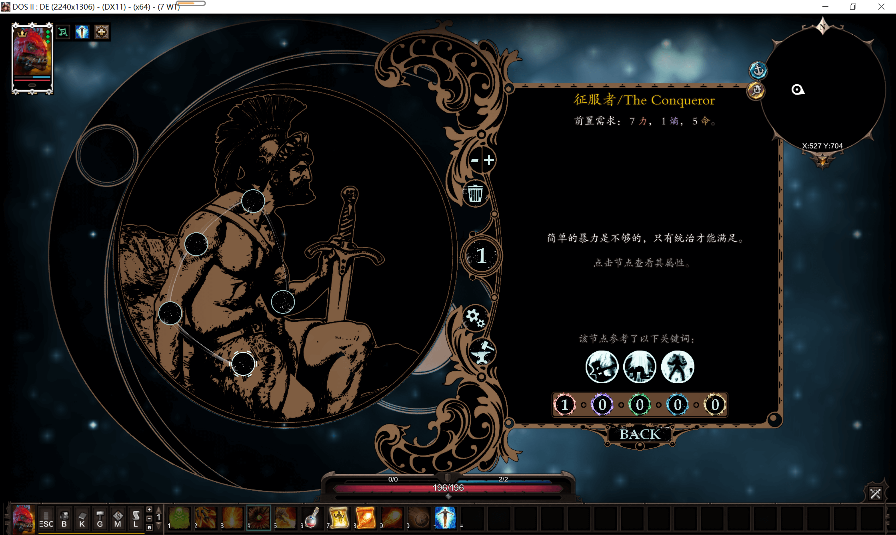
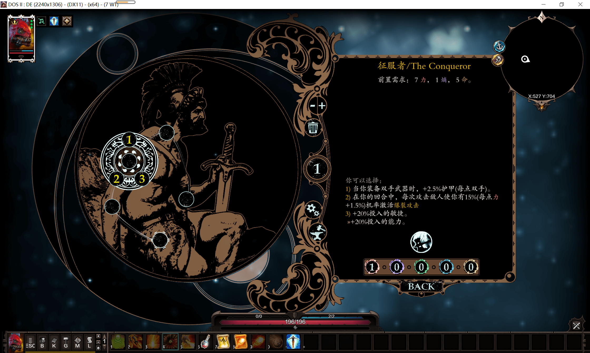
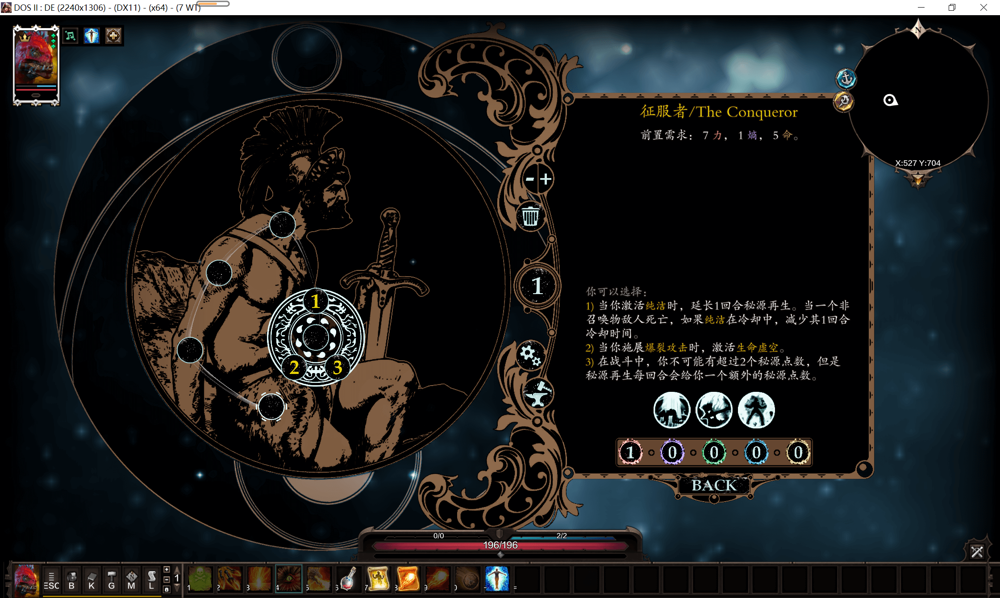
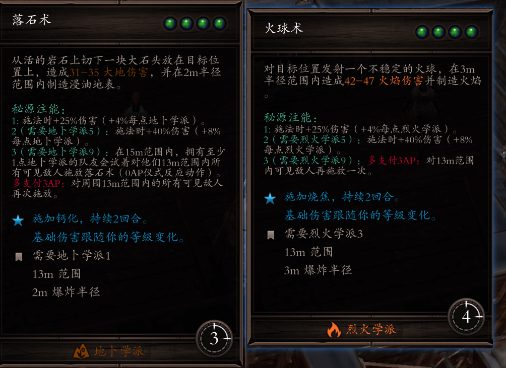

---

---

# EE介绍
详细介绍可见谷歌文档：[Epic Encounters Feature/Change Log - Google 文档](https://docs.google.com/document/d/1du5jE2dyDE4B4-Za0wolfe50ReeKXqkqdgG5FvAwKTo/edit)

## 基本介绍
EE即Epic Encounter mod的简称，中文译名为史诗遭遇，由两位作者：Matteo "Ameranth" T.和 Davide "Elric" T.创作。

史诗遭遇为对神界原罪2有`重大游戏性上修改`的mod，但并`不涉及增加怪物`，不同于1代dos的史诗遭遇（1代同样有史诗遭遇）

## EE的重大修改

### 飞升
EE最独特的系统为飞升系统，在打完序章的教学船后，玩家上岸会立即获得冥想技能,使用后可进入飞升界面

飞升界面，mod设置及伟大熔炉将在后续章节详细讲解。

其中，飞升界面是EE构筑build的核心，不同于原版简单的学派+天赋+属性三合一就能构筑的build，史诗遭遇构筑的核心是飞升，飞升由大星座，中星座，小星座组成。

一般来说小星座提供具象点数，中星座作为构筑触发器，大星座是构筑的核心效果。

以下是一个例子，放出的星座是征服者，是史诗遭遇最具代表性的一个大星座。

你现在不需要弄懂什么是生命虚空、爆裂攻击、纯洁等术语，这些都是史诗遭遇新增的内容，你现在只要知道这是史诗遭遇核心的星座就够了。通过星座+神器+技能，你可以构建出非常酷炫的build。

### 技能

不同于原版的技能，EE移除了所有的源力技能（群体尸爆、大地之怒等），但是，EE给剩余99%的技能添加了1、2、3级的注能，下图为落石术和火球术的1、2、3级注能效果。

什么是`秘源注能`呢？秘源注能是角色`解开秘源项圈`后可以获得的一个技能，使用1次秘源注能后`下一次使用的技能会获得注能1的效果，2次即获得注能2+注能1的效果，3次即注能3+注能2+注能1的效果`。因此EE的技能配合注能可以获得非常多变的效果。

尽管没有了群体尸爆，但是2注能的尸爆也是爆炸所有可见的尸体。

以下列举是其他的一些技能，仅放出部分。

### 神器

神器是EE新制作的100+件独特新装备，有武器、胸甲、鞋子、戒指等不同的独一无二的装备，各自有叫做`神器威能`的强大效果，部分神器有着化腐朽为神奇的效果，配合飞升和技能可以获得强大的构筑效果。

其中神器威能是每件神器固定有的，而其余的属性均为随机获得的。

### 抗性和debuff

原版游戏中，仅有魔法有对应的抗性，而物理、穿刺并没有抗性（相当于真伤）

而在史诗遭遇中，所有敌人随着等级都将获得高额的物理抗性、穿刺抗性、魔法抗性（弱点仍然存在，如弱火的巨魔）。

图为序章默认难度下1级猎犬的抗性

而在后期阿克斯城最高难度`死而无憾`下，`怪物的抗性将达到惊人的200%！`

那么如何降低敌人的抗性呢？

史诗遭遇引入了一种叫做堆叠状态的新机制。

造成物理、穿刺伤害将给怪物挂上重创的状态。

造成任意魔法伤害将给怪物挂上蹂躏的状态。

而仅仅这两个状态并没有任何作用，但是消耗这两种状态可以给怪物挂上三级debuff状态。

三级debuff状态就是史诗遭遇中最常用的降低抗性的方法。

以下是我节选的日志中对堆叠状态的介绍，想了解更多可以按下L键日志，里面的层级状态，重创/蹂躏一栏详细介绍了这个机制，虽然字很多但是机制并不复杂。

::: tip

史诗遭遇用层级状态来重新平衡像是冻结、晕眩这类的常见状态。没有状态能像以前一样可以完全控制目标,相反，它们能各自施加一个独特的效果(通常在第3级层级状态下)，如沉默或缴械--同时，它们都会造成抗性的减少。

:::

利用技能和飞升，可以打出1、2、3级的debuff状态，由低到高施加抗性减益的效果，怪物也将变得更加羸弱。

#### 物法混队

物法不能混搭，是神界原罪2原版游戏中许多人认为的一种缺陷（虽然我觉得混搭也一样能玩）

::: tip

但在EE中，物法混搭变成了极力推荐你使用的一种玩法。因为物理debuff（脆弱、失调、虚弱、制伏）施加的是魔法抗性的降低，而魔法debuff（减速、缄默、恐惧、目眩）施加的则是物理抗性的降低

:::

因此，纯伤队在EE中是比较难玩的，笔者推荐你`物法混搭`，不仅仅是战士配合法师，因为EE把`力量和敏捷和智力的增伤合并到了能力`中去，因此，你甚至可以`一个人同时物法双修`，即是狂战士又是大法师，这完全不会影响你的攻击性，反而更强。

### 反应动作

反应动作最简单的体现是原版的借机攻击，但EE的反应动作远比他复杂，有一套复杂的体系进行配合，由队友乃至敌人触发你的反应动作，打出炫酷的反应。

在史诗遭遇中,反应动作系统是角色参与战斗的全新方式,它可以从`飞升或神器中得到`。从本质上讲,它们是一个角色在没有轮到自己的时候,对特定事件做出的反应。
每个反应动作都有他`特定的激活条件`,不过每个反应动作`有需要至少1AP`,除非反应动作另有说明，或者角色有某种方式可以增加其消耗(像是伺机而动这种天赋)。
你可以围绕反应动作系统来构建你的队伍,不过要注意这些行动的AP消耗。

反应动作将在后续章节详细深入讲。

### 其他修改

最开始也讲了EE是纯游戏性修改的mod，因此与非常多的mod冲突，冲突一栏请看下一章的`冲突mod栏目`

这里讲一些其他的修改。

#### 战斗修改

1. 战斗内外的秘源分开，进战自动清空秘源，随着回合自动恢复，配合秘源注能来加强技能。
2. 战斗外召唤物会立即死亡
3. 脱战、入战范围被极大的扩大了
4. 移除了原版所有的控制，转而被debuff代替，不再有简单无脑的硬控了
5. 复活的角色本回合若已行动过则不能再行动
6. 先攻和预备状态（详细见L日志）
7. Ap获得和消耗全部翻倍
8. ...

#### 非战斗修改

1. 免费赠送动物秘源、独狼天赋
2. 商人、1章水井 最高出紫装
3. 偷窃只能一次，且前期数额下降、击杀商人收益削弱
4. 伟大锻造炉（详细见后续章节）
5. ...
