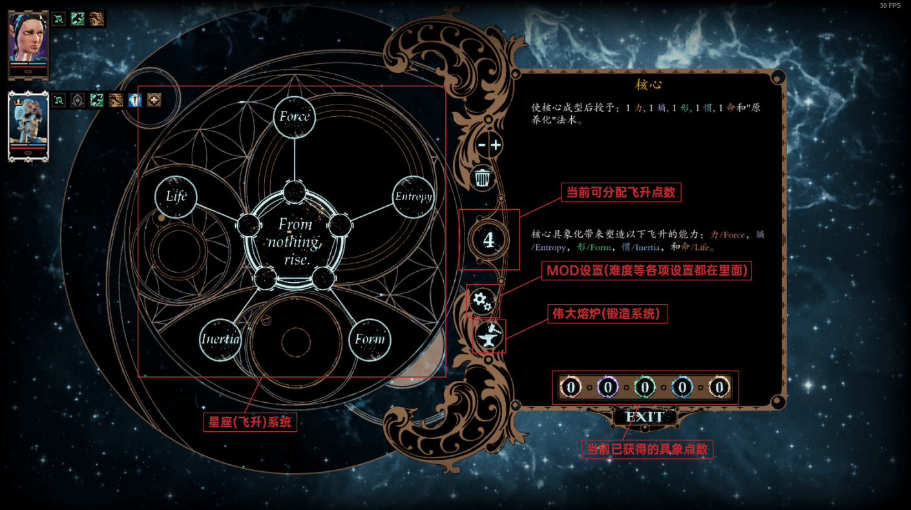
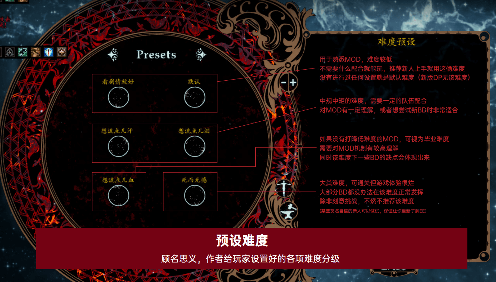

# 难度设置

::: danger 

游玩史诗遭遇请必须使用策略难度开档 

:::

EE是基于策略难度做的基本数据调整。所以不要使用其他的难度

而EE自身也有几套难度预设，但也能通过高自定义的设置来调整难度，默认情况下，EE使用的是较简单的默认难度，打得过原版策略的玩家也能不困难的通过这个难度。而最高难度死而无憾需要对EE完全了解的玩家才能游玩的难度。

## 进入难度设置页面

从飞升界面首页，中间齿轮状图标进入。

## 难度预设

::: tip 

请选择一个合适的难度 

:::

主要分为四档

其中`每一档都远比前一档难`

每提升一难度，怪物不仅仅有巨大的属性提升，同时还将获得巨大增益（AP增益、抗性增益、额外的技能、甚至包括最困难的自动注能）。

### 一档

本档敌人很弱，没有自动注能。

- 看剧情难度
- 默认难度

### 二档

本档所有敌人自动获得注能1，即所有技能强制最低以1注能释放

::: danger

注能1将同时获得默认+注能1两重效果。

:::

- 流汗难度
- 流泪难度

### 三档

本档所有敌人自动获得注能2，即所有技能强制最低以2注能释放

::: danger

注能2将同时获得默认+注能1+注能2三重效果。

:::

- 流血难度

### 四档

本档所有敌人自动获得注能3，即所有技能强制最低以3注能释放

::: danger

注能3将同时获得默认+注能1+注能2+注能3四重效果！！

:::

- 死而无憾难度

## 难度自调整

接下来会有两个循环界面，设置项目是相同的

## 