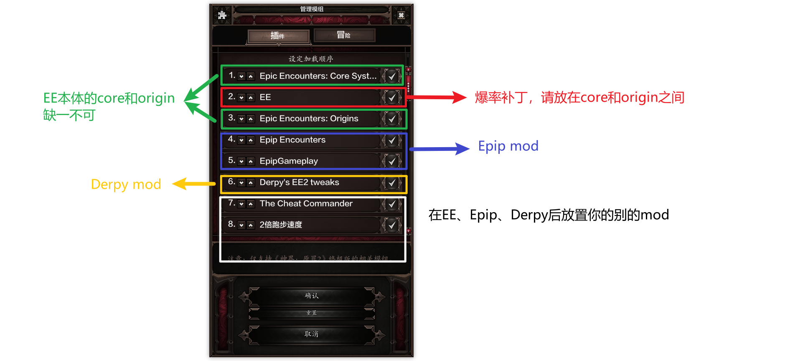

# mod排序

## 图片版

## 文字版

1. 首先放置Epic Encounter Core和Epic Encounter Origin，两者缺一不可
2. [可选]爆率补丁放在core和origin之间
3. [可选]Epip两个文件（之间没有顺序），放在EE两个文件之后
4. [可选]Derpy一个文件，放在Epip之后

::: danger 注意

EE是Epip和Derpy的前置，必须安装EE两个mod文件

:::

::: danger 注意

Epip是Derpy的前置，玩Dp必须安装Epip

:::

## 注意事项

1. 爆率和Derpy不兼容
2. improved hotbar mod和Epip冲突
3. ...

## 例外

安装miniboss会出现`打不开冥想`的问题，请把MiniBoss放在最顶部，让EE覆盖miniboss