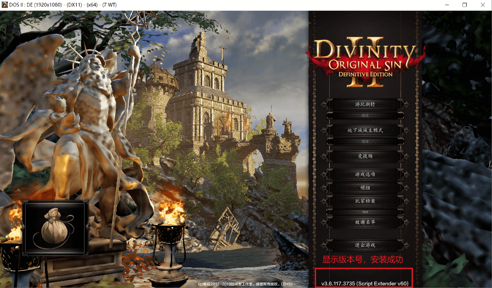
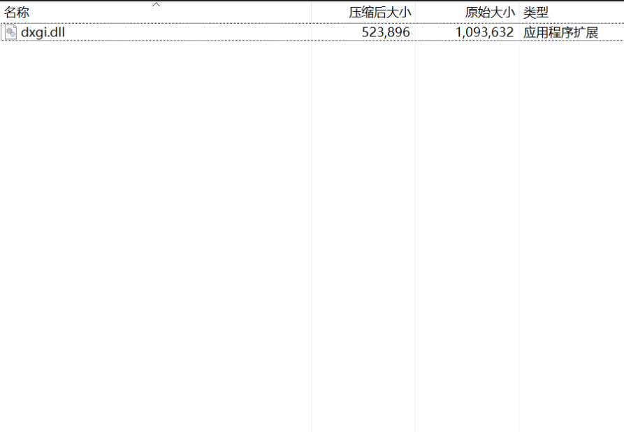
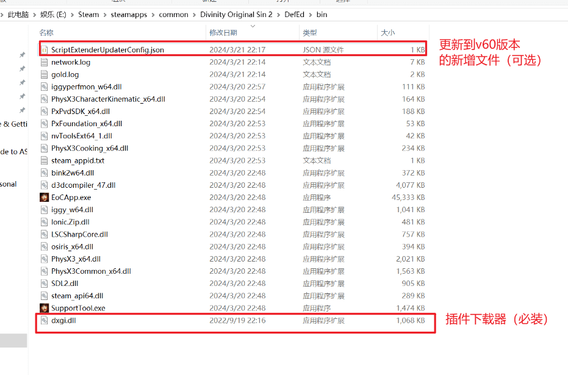

# 插件安装必看

## Norbyte's Script Extender插件安装

插件即Script Extender插件，普遍被称为成就插件、成就mod（实际上不是mod）

主要作用是给部分高级mod提供支持，解锁成就只是其中一个功能

如果你的游戏主菜单右下角有类似v59 v60的版本号，即本插件已经安装，可以略过本章不看

如果你是`手柄界面`，那么安装成功版本号也不会显示，你如果不确定可以拔下手柄重新进入确认安装成功后再使用手柄。

插件安装见作者github：[Norbyte's Script Extender](https://github.com/Norbyte/ositools/releases)

鉴于github很多人无法访问，因此放出分流：[蓝奏云](https://wwp.lanzoum.com/ioZqK1s534if) 密码:3zv4

解压后可以获得到一个dll文件:`dxgi.dll`

放到游戏根目录即可自动完成插件的安装。

::: tip

steam安装路径\steamapps\common\Divinity Original Sin 2\DefEd\bin
找不到steam安装路径，可以用steam的右键-查看已安装文件功能找到根目录

注意插件是给终极版使用的，路径中有DefEd，没有的话是原版，安装到错误的位置了

注意这个是下载器而非插件本身，因此插件安装还需要你能够正常访问到插件的下载地址，因此非常多人遇到的`插件无法安装`的问题，即你的网络问题（绝大多数都是移动用户），访问不到对应的资源地址，和你使用的下载器完全没有关系。

解决方法使修改自己的网络环境，如使用手机热点，开梯子。

:::

### 截图

## pip插件安装

如果不管你怎么尝试，始终无法安装Norbyte's Script Extender插件的话，pip自己也维护了一份插件，经过笔者尝试可以安装，下面放出下载链接和分流链接

[Extender - Google 云端硬盘](https://drive.google.com/drive/folders/1I2ZXjbDkZW-WCdC_-EBNQvimHVHssL7m)

[蓝奏分流](https://wwp.lanzoum.com/iQo2x1saofba) 密码:gpyu

下载后获得libprotobuf-lite.dll、DXGI.dll两个文件

::: tip
1. 先删除之前放的Norbyte's Script Extender的DXGI.dll文件
2. 再steam校验文件完整性
3. 把libprotobuf-lite.dll、DXGI.dll两个文件放到steam安装路径\steamapps\common\Divinity Original Sin 2\DefEd\bin 即游戏根目录中去
4. 现在进入游戏，主界面应该有版本号了
:::
