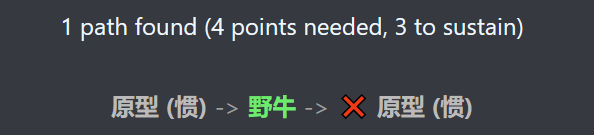

# 异彩秘源火法
## 嘲讽百夫长

- [x] 不基于Derpy

这个bd的特点嘲讽敌人。

前期犀牛百夫长变战争践踏，配合卫兵可以群体嘲讽，中期可以升级群体断筋

后期利用守望可以获得高额抗性和护甲恢复。

## 构筑

### 飞升

1. 4点，野牛持盾嘲讽
2. 9点，卫兵百夫长嘲讽，犀牛百夫长变1次战争践踏，达成群体嘲讽
3. 14点，增加百夫长注能百夫长变断筋
4. 19点，剑士激活百夫长回甲增伤
5. 24点，斗士3.2、4.2、5.2，梆硬

### 推荐神器

胸甲：山、上古之甲

项链：大角星

所有物伤转魔伤神器

戒指：简朴

盾：坚石

### 推荐技能

战争：守护天使、嘲讽、挑战

刺杀：肾上腺素、破坏

### 推荐加点

属性点优先体质、力量、智慧抢先攻，记忆够学技能即可。

学派点：坚毅，学派根据需求的技能注能来

天赋：早起之人、体格强健、伺机而动、博闻强记、轻兵锐卒

## 构筑路线

4点飞升

9点飞升

14点飞升

19点飞升

24点飞升（19级）

