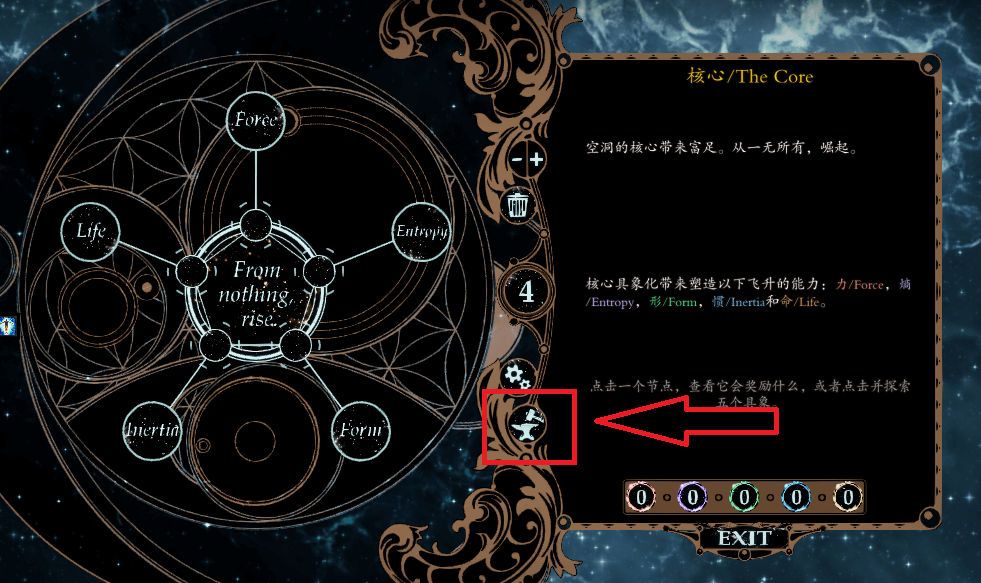

# 伟大锻造炉

## 锻造炉位置

 在飞升界面的==中间偏下位置==可以找到一个类似“锻造台”的图标，点击图标即可进入==伟大锻造炉==的界面，点击画面中出现的方块，选择一件任意装备，即可进行下一步操作。

## 锻造炉功能

| 锻造炉功能名称 | 锻造炉功能详细作用 |
|:----:|:-|
| 分解 |花金币将所选中的装备分解为神匠碎片，神匠碎片可以理解为伟大锻造炉中对装备进行各种操作的货币|
| 装备升级 | 利用神匠碎片将装备等级提升，可以一直提升到人物当前等级 |
| 杰作 | 选择装备中的一项词条进行增强，比如+1战场技艺可以通过杰作变成+2战场技艺，+3能力变成+4能力，甚至是武器的攻击距离增加等等效果 |
| 聚合 | 选择模组中掉落的神器，将神器变成符文，镶嵌在神器对应位置的装备孔位中，即可获得神器的效果，神器聚合的符文只能镶嵌在神器本身装备孔位，比如胸甲神器保险库只能镶嵌在胸甲，鞋子神器绝望只能镶嵌在鞋子上 |
| 转换 | 将一件装备转化为同品质的随机装备，独特和神器不可以转化 |
| 保留词条 | 将拥有复数词条的装备保留为仅有一次词条的装备，这个功能有两个作用，一个作用是搭配下面的融合，把仅有一个词条的装备融合到其他装备当中；另一个作用是刷装备的品质，比如你有一个不错品质的盾牌，但是它的双甲都很低，就可以利用保留一个词条来刷新他的双甲品质。 |
| 融合 | 将拥有单一词条的装备的那个唯一的词条融入你之前选择的装备当中，这个可以让你强化装备，比如你是一个需要刺杀学派的刺客，你可以把其他装备的刺杀学派融入你的装备之中；甚至你还可以自己从零开始打造一件属于你的装备。
| 提升符文槽 |这个是EP给予的功能，原版EE是没有这样的功能的，字面意思|
| Engrave |给予你所选中的装备一个名字|
| 提取符文 |将装备孔位中符文取出，在史诗遭遇游戏中，以原版的方式拆取符文会导致符文损坏，要注意|

## 伟大锻造炉的使用技巧

 - EP版本下装备的质量会以百分比的方式展现在面板之中，要注意。
 - 不同品质装备的百分比一样，面板也可能不一样，比如神圣（金色）的75%品质面板要比史诗（紫色）的75%品质面板要高一些。
 - 副手武器的暴击伤害词条并不能生效，请各位双持大侠将暴击伤害打在主手。
 - 武器中带有的元素伤害词条不能杰作，所以看到+25%元素伤害，还请珍惜。
 - 胸甲装备中有+1注能效果词条，这个+1注能是你在注能之后，才会触发。也就是说，这个效果并不能0+1；只能是1+1或者2+1来触发。
 - Derpy版本中戒指有未注能的XX（技能）将以1注能释放，这个是注能之后就不能+1，而没注能才可以+1；和胸甲中的注能词条不一样。
 - 不同品质的装备，可拥有的词条数也是不一样的，神圣（金色）可以拥有6个词条；传说（红色）可以拥有5个词条；史诗（紫色）可以拥有4个词条；稀有（蓝色）可以拥有3个词条；精良（绿色）可以拥有2个词条。
 - 游戏内有三种需求装备，需求力量的，需求敏捷的，无需求的，而三种装备都有独自的固定词条，需求力量的装备会给你一些物理抗性，需求敏捷的装备会给你一些闪避率，无需求的装备给你记忆，这部分固定词条无法被保留。
 - 杰作非常耗费神匠碎片，尽可能少杰作，甚至是不杰作。
 - 炼金虽美好，时间不等人；联机游戏的时候还请适当调整炼金时间。

## 固有词条和非固有词条

使用杰作或保留词条功能时，有固有词条和非固有词条这两种概念。

固有词条即装备本身必定拥有的词条，如重甲的物理抗性，双手武器的50%顺劈，匕首的背刺暴击。

而非固有即不是固有的词条，为随机的词条，常见的为+X学派，+X属性等。

而伟大锻造炉不可对固有词条进行操作，即你不能把匕首的背刺暴击词条移动到双手武器上。

但是你可以对非固有词条进行操作，把装备A的+4烈火词条移动到你想要的装备B上，反复操作，可以获得一件强力的神装。

## 装备词条上限

越高评级的装备，能够拥有的非固有词条就越多

### 词条上限

- 神圣：6条
- 传说、神器：5条
- 史诗：4条
- 稀有：3条
- 优秀：2条
- 普通：废品

### 装备解析

下图这件神圣戒指，戒指并没有固有词条，因此5条词条都是非固有，你现在还可以通过`融合`功能把一个词条融入到这个装备上，达成6条词条的总数。

### 词条类型限制

- 但是注意，每种装备能拥有的词条是不同的，如武器的暴击伤害词条，不能拆卸给别的类型的装备，只能被武器拥有。

- 同时，装备根据等级，会获得不同的上限，前期只能杰作到2学派，而18即后可以杰作到4学派。

具体可通过这个网站查询。

[EE2 Gear Mods (pinewood.team)](https://www.pinewood.team/ee2gearmods/)