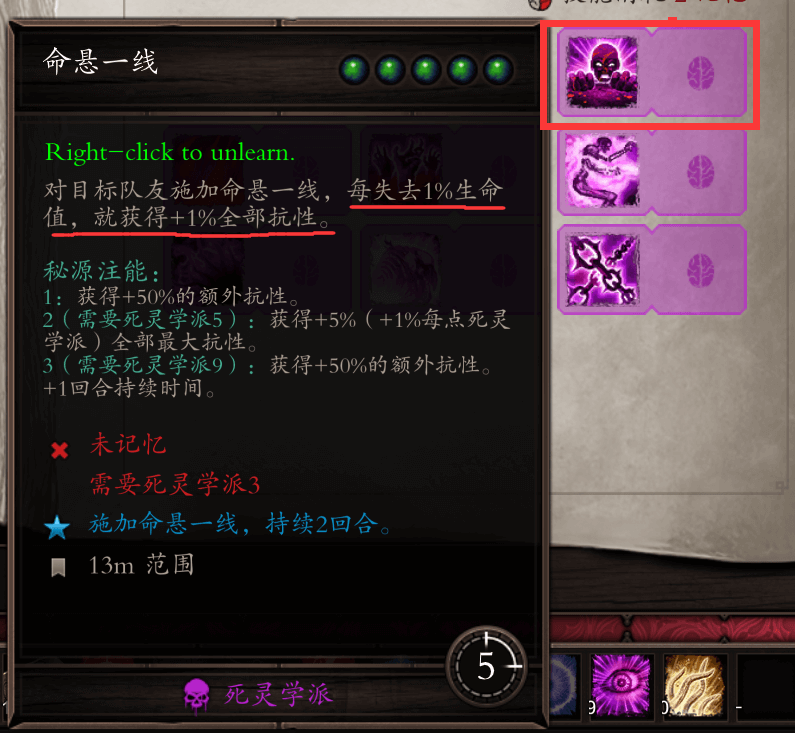

# 本章导言
史诗遭遇（以下简称EE）几乎删改了原版的所有技能效果，比如说：

- 投掷爆炸陷阱在原版是一个非常优异的输出技能，但是在EE中却被更改为必须部署一个回合之后才能爆炸
- 死灵学派的命悬一线的效果从原版中不会让角色的生命值小于1，变成了根据剩余生命值增加抗性，血量越少，抗性越高
- 变形学派的变鸡只能使敌人的召唤物变鸡，对于敌人则变成了堆叠重创或者蹂躏（以下简称层数）的效果
- 刺杀学派的三秘源技能处刑在EE中也不再要求秘源，同时也把斩杀线的规则改变，从敌人剩余20%触发斩杀效果变为敌人剩余血量比这次处刑伤害低的情况下斩杀
- 火花大师和群体尸爆则是被删除，变成了火花飞溅和尸爆的注能[^注能]效果

类似于上述中的技能改动在EE中比比皆是，此专栏将结合笔者游戏经验，将一些有特色的技能推荐给大家。

> 还有一点不同于原版，原版游戏中技能获取的等级是1级、4级、9级、13级、16级；而EE模式下，9级即可解锁全部技能。从1级开始到9级为止，根据当前人物等级变化，技能商人会解锁若干技能，一般来说4级和6级是两个重大技能更新点，4级可以解锁70%左右的技能，6级解锁90%左右技能。
>
> 另外EE模式也有EE、EP、DP三种不同的版本，所以具体的技能效果请参照游戏内的技能描述。

[^注能]: 在EE中解锁秘源项圈之后可以获得一个叫做源力注入的技能，在人物有秘源的情况下，使用源力注入可以触发对应技能所描述中的注能效果。每场战斗开始时将清除人物全部自带的秘源，并给予三个回合的秘源再生，在战斗中的第二个回合开战，每个回合会给予角色一点秘源。