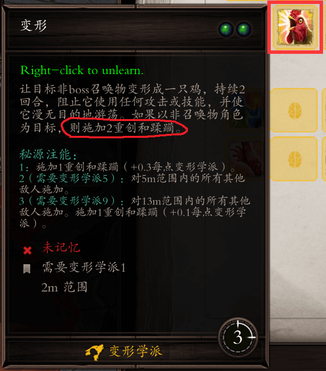
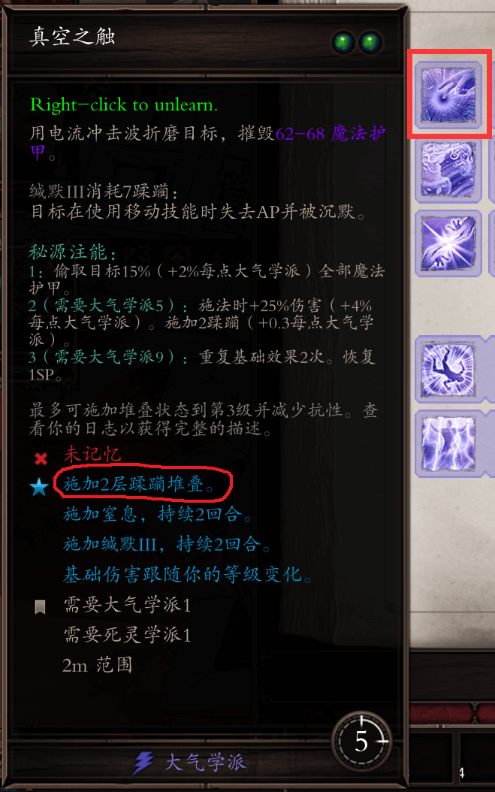
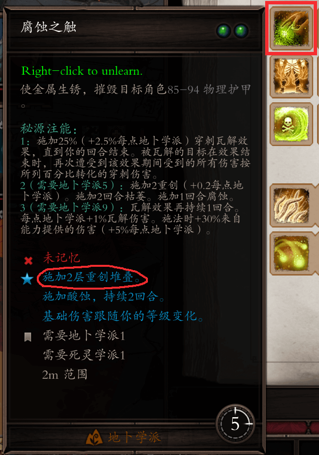
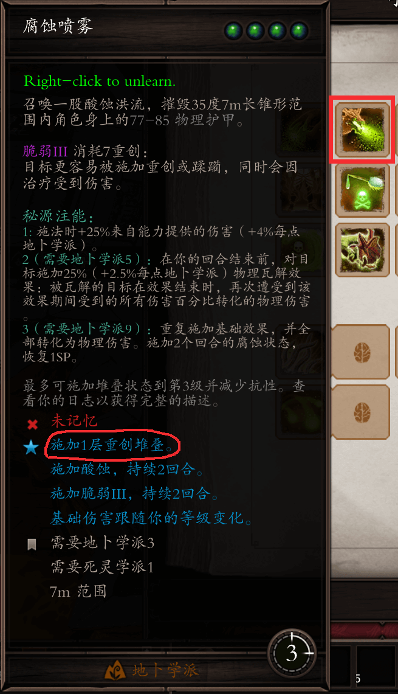
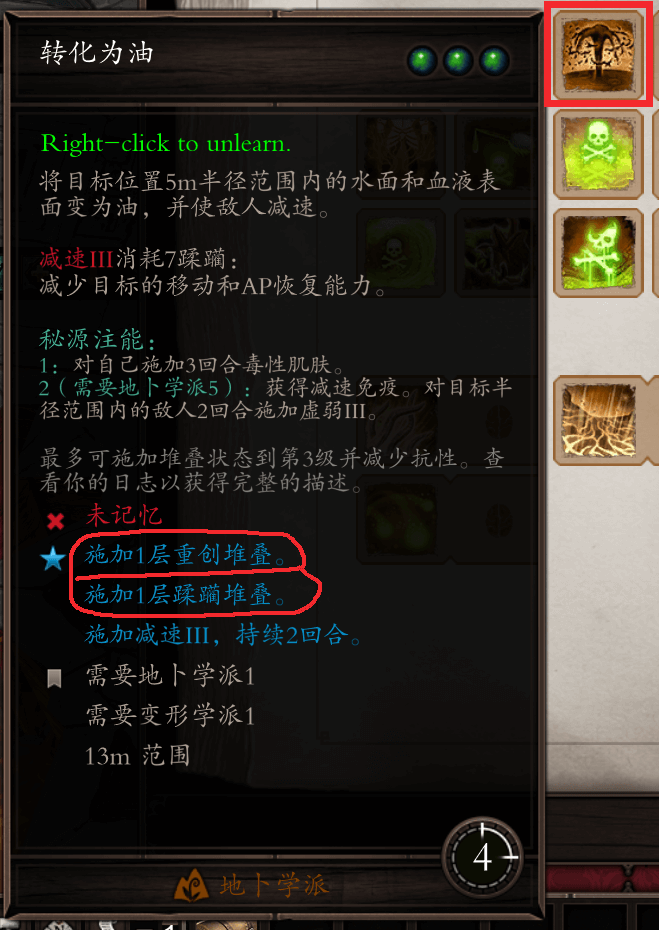

# 叠层技能

在EE中给敌人叠加重创和蹂躏（以下简称层数），然后打出减益（debuff）控制敌人，同时还能降低敌人的抗性，是非常重要的操作。

比如对方阵营有一个棘手的法师，如果你能有效给敌人上3级缄默（沉默-无法施法），就能有效的封锁法师的行动。

正常来说，层数需要打物理或者魔法伤害来叠加，而有一些技能可以无视伤害条件直接上层数，比如：

- 变形学派的变鸡（两层重创两层蹂躏）
- 大气学派的真空之触（两层蹂躏）
- 地卜学派的腐蚀之触（两层重创）、腐蚀喷雾（一层重创）、转化为油（一层重创一层蹂躏）

> 要注意，EE和EP版本中转化为油是上层数的技能，DP版本转化为油则取消了上层数的效果，技能具体效果请参照游戏内文本介绍

其中真空之触是尤其优秀的技能，即是攻击护甲，还自带上层数效果，同时还有3级缄默的debuff。

