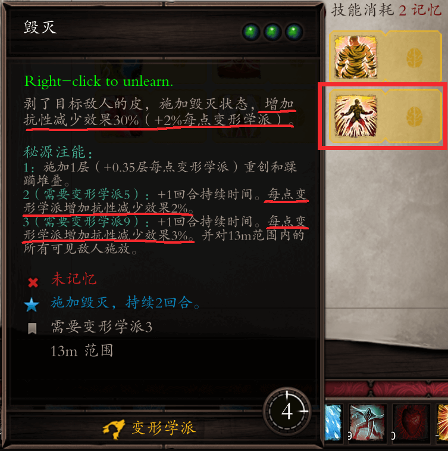
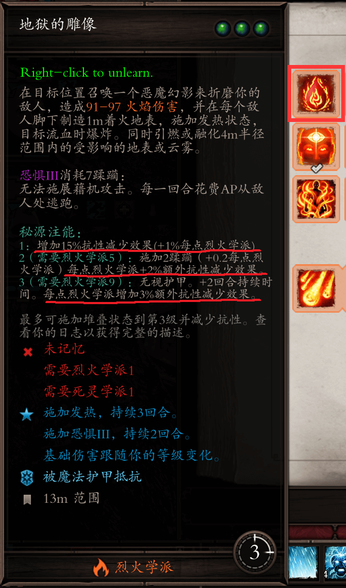
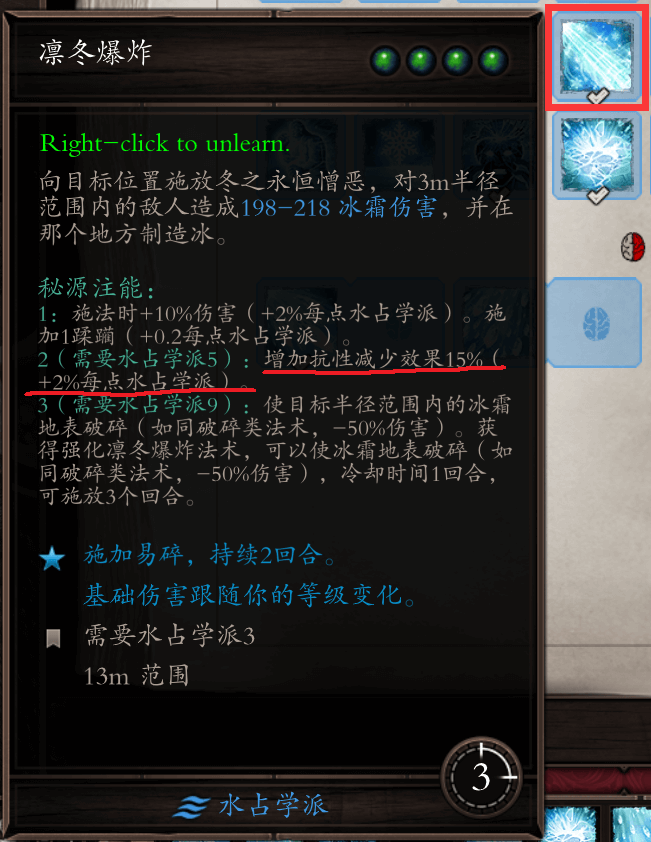
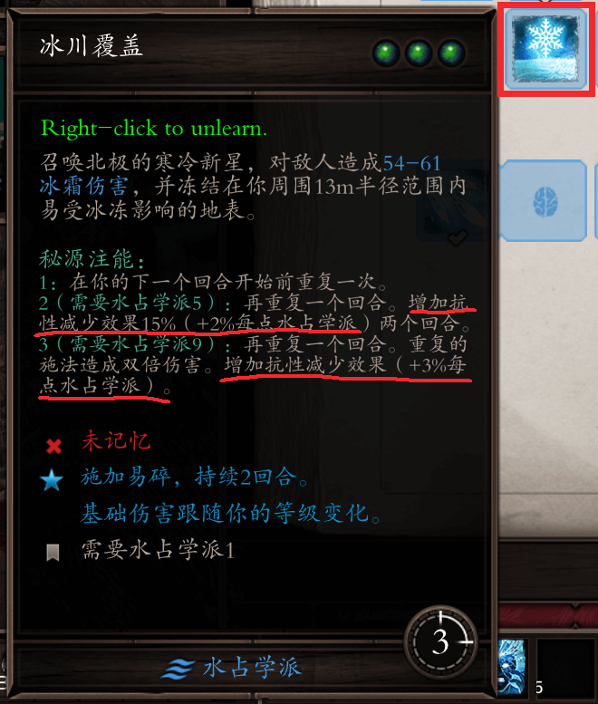
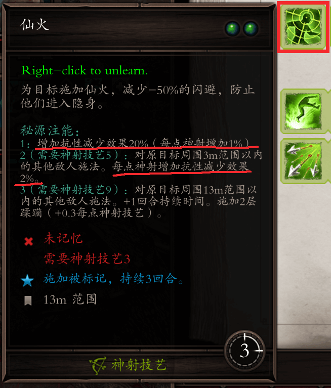

# 极端减抗技能

在EE的高难度下，后期敌人抗性可能是130%甚至以上，虽然他们的面板显示可能是80%，或者90%（根据难度不同，敌人抗性上限也不同），这是因为敌人的抗性上限就在那里，而隐藏在上限面板之下，他们的抗性往往会更高。在这种情况下，即是给敌人上了两个减抗debuff，也只是减少100%的抗性，你不得不面对血量超多而且抗性还在30%以上的敌人，你的伤害会大幅度打折。

这种情况下有一类技能可以增加debuff的减抗效果。比如说：

- 变形学派的毁灭
- 烈火学派的地狱的雕像
- 水占学派的凛冬爆炸、冰川覆盖
- 神射技艺的仙火

具体的计算方法，以3注能毁灭为例子，假设人物变形学派为10，3注能毁灭的增加抗性减少效果为（30+2×10）+（2×10）+（3×10）=100，也就是说每个抗性减少的效果都翻一倍，原来一个减少50抗性的3级debuff，在3注能毁灭的加持下可以减少敌人100抗性，两个3级debuff就是减少200抗性，这样本来130%抗性敌人，瞬间就变成了-70%的抗性，战斗瞬间轻松了不少。

> 其实极端减抗技能中只有毁灭和地狱雕像比较常用。凛冬爆炸极端减抗效果不佳，更适合打输出使用，3注能自带粉碎。冰川覆盖则是队伍里面的坦克可以用一用，一般来说应用环境也较少。而仙火主要是减少敌人的闪避率，极端减抗效果也不算特别突出。

