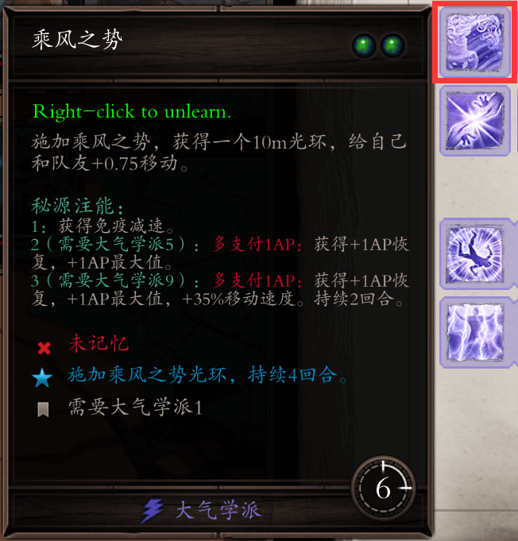
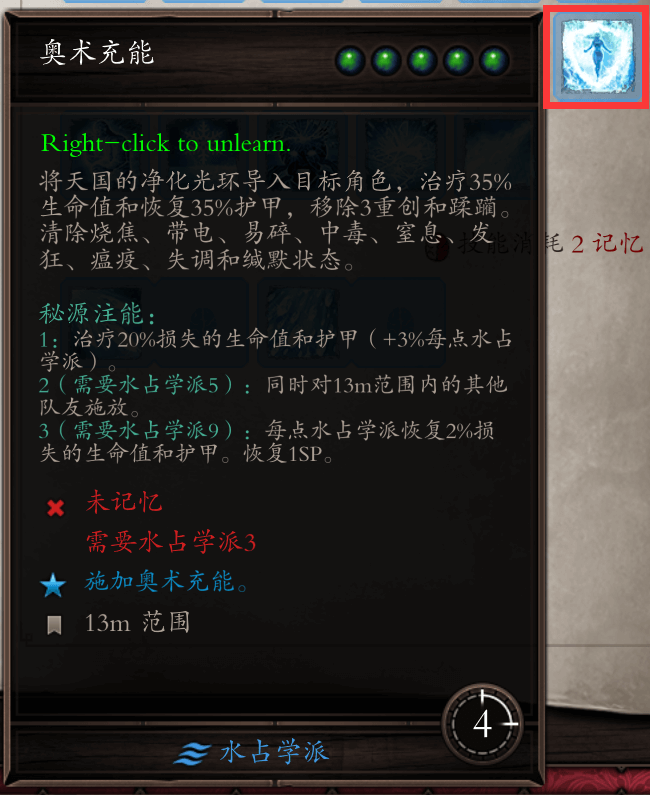
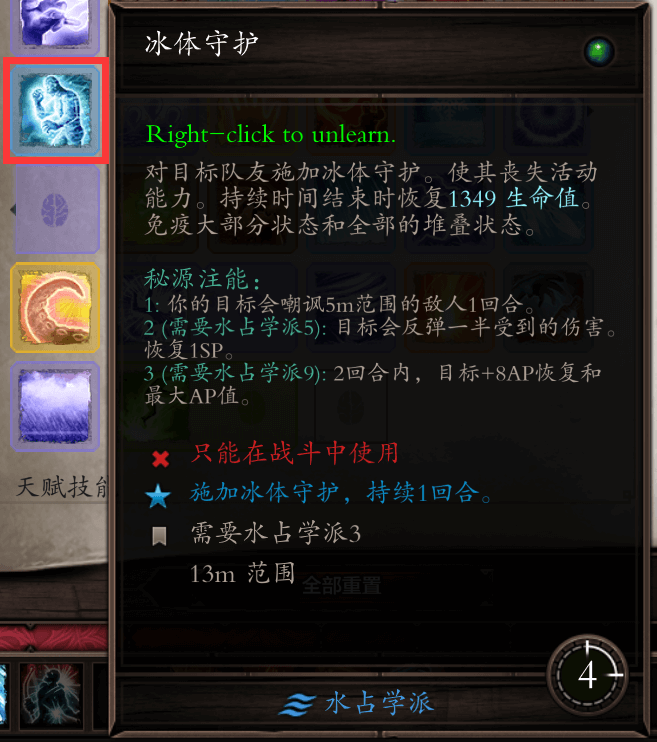
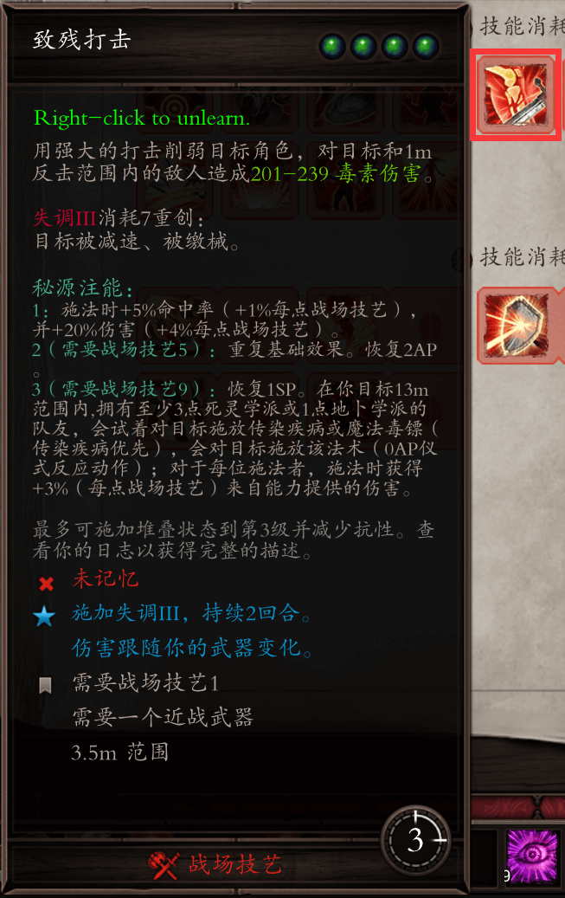
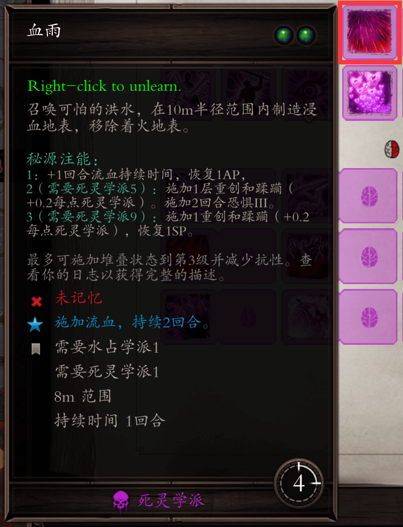

# 注能技能

EE中，很多本身并不是有特色的技能会因为注能而变得完全不一样，比如：

- 叠层技能中提到的真空之触在1注能之后，可以直接破坏对方（15%+2%*大气学派）魔法护甲，并且在有注能的情况下，只需要敌人身上有5层蹂躏堆叠即可上3级缄默。相当于敌人身上有3层蹂躏之后，再用1注能真空之触就能直接上3级缄默。甚至是2层蹂躏，因为真空之触本身也能破坏魔甲，也能上1层或者更多的蹂躏，实战中自行把握。
- 刺杀学派的催眠药剂，在1注能之后，便可以给敌人直接上层数。当你有10点刺杀学派时，就可以直接上2+0.3*10刺杀学派=5层蹂躏，根据注能之后只需要5层蹂躏消耗便可以上3级debuff的效果，可以直接1注能上目眩。
- 大气学派的乘风之势，在1注能之后，可以获得一个免疫减速的光环效果，在EE和EP原版中搭配坚定意志药剂，可以做到免疫制服、恐惧、缄默、目眩、减速，一共5中debuff的免疫。注意：DP版本修改了坚定意志药剂的作用，变成了给予5回合冷静（心静神宁）的效果。
- 水占学派的奥术充能，在1注能之后，可以恢复大量的生命值和护甲，当队友状态不佳时，可以利用1注能奥术充能瞬间满血。当然对方不能是亡灵，或者对方身上有3级脆弱。
- DP版本中，水占学派的冰体守护，在1注能之后，就可以使冰体守护的目标变成无敌的同时嘲讽其周围的敌人，使敌人疯狂攻击无敌的队友，是非常有意思的技能。
- 另外还有一些借助外力的技能，EE中的胸甲有时会刷出来一些“施加：+1XX技能注能”的词条。这样的词条效果使你在注能XX技能的时候，给你一个赠送的+1注能效果，比如你的胸甲有一个“施加：+1致残打击注能”的词条，当你1注能致残打击时，就会自动释放1+1=2注能致残打击的效果，同理，当你2注能时，就是3注能的效果。胸甲词条注能+1的效果并不需要学派等级的需求，本来3注能致残打击需要9点战场技艺才能释放，但是因为+1不需要学派等级需求，所以5点战场技艺满足2注能的条件下，也可以利用胸甲的词条2+1，打出3注能的效果。而致残打击多数作为1+1注能释放，因为致残打击的2注能可以回复AP，还能重复基础效果打两次，十分强力。
- 根据上面的“施加：+XX技能注能”的效果，血雨术也成为了强力的技能。血雨术的基础效果就是上流血，但是因为注能上层数，上debuff，回复AP，甚至是SP的效果，经常被玩家称为神技。一般来说都是堆高死灵学派，然后2+1注能血雨。

> 注意：胸肌上+1注能效果的词条必须是在有注能的情况下，才会X+1注能。如果没有注能直接放，是不会有0+1注能效果的。
>
> 真空之触的图片参照叠层技能专栏，催眠药剂的图片参照破甲技能专栏。

