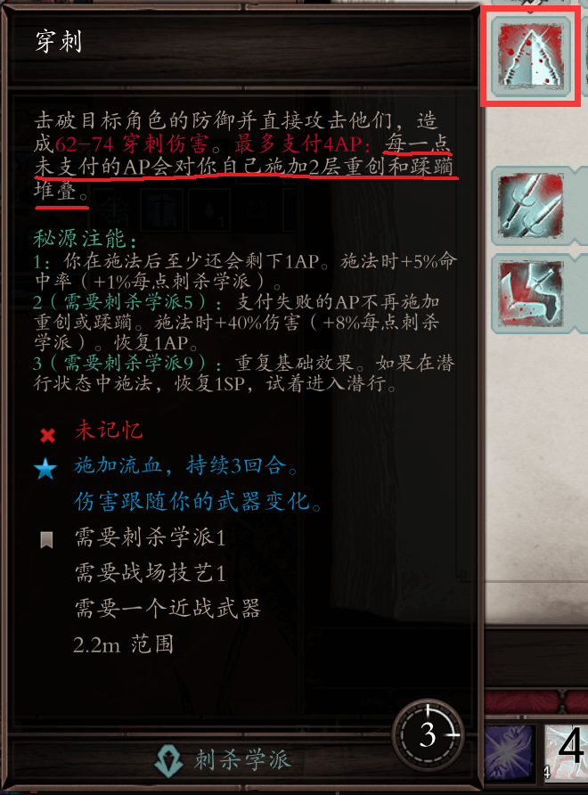
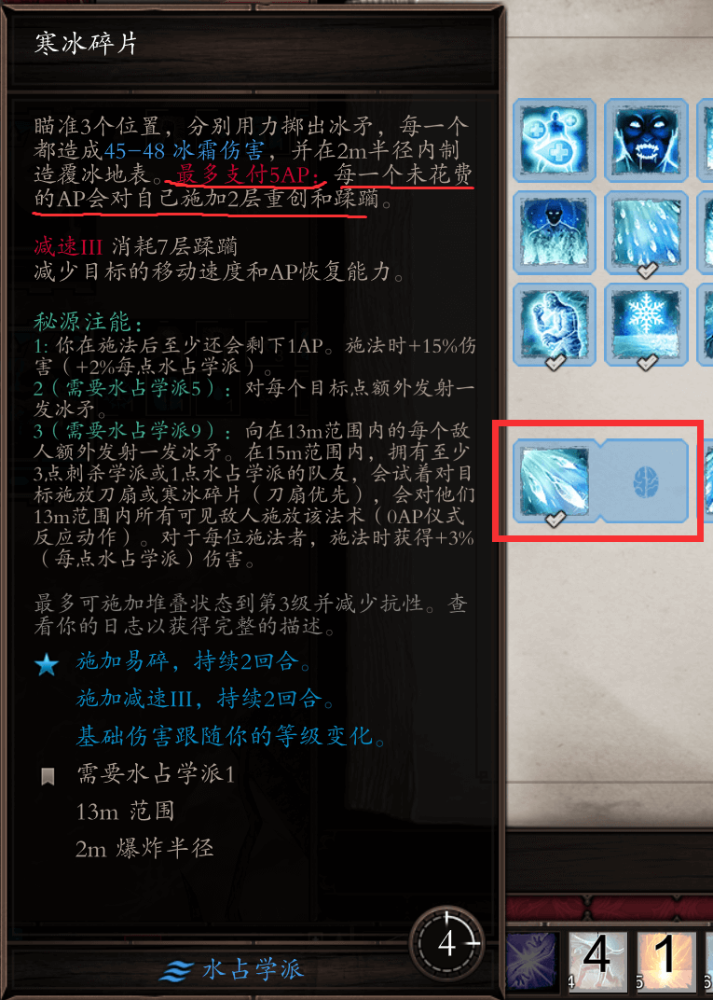
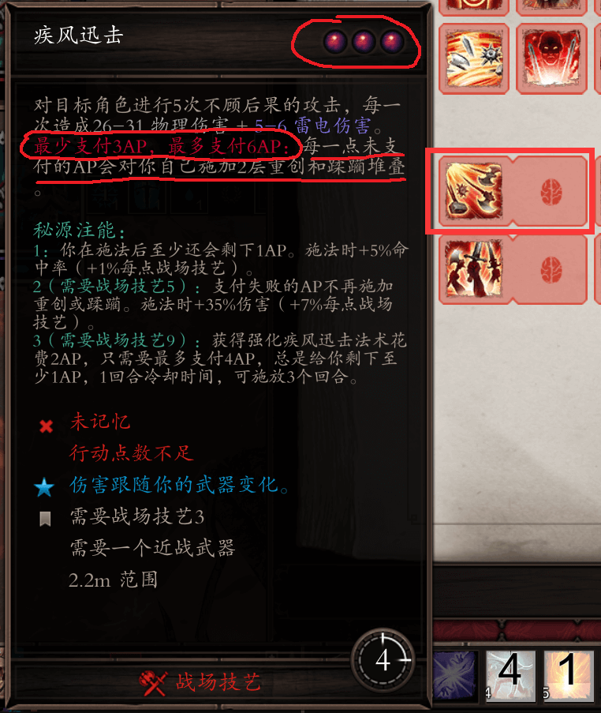

# 白嫖技能

在EE中有一部分技能可以用1点行动点数（以下简称AP）来释放，比如说：

- 变形学派的鞭挞之触
- 刺杀学派的穿刺
- 神射技艺的凌空射击
- 死灵学派的诅咒黑雾
- 水占学派的寒冰碎片
- 大气学派的电击之触
- 地卜学派的酸蚀孢子
- 召唤学派的灵魂挚友和进化
- 战场技艺的嗜血和疾风迅击

这些白嫖技能可以以被堆叠层数的代价，来取代AP的消耗。原本可能需要5个AP的寒冰碎片，其实1个AP就能满足释放条件。这样的技能往往可以在行动的最后，剩余AP并不足以做其他事儿的时候释放，增加本轮内的输出和控制能力，甚至可以搭配反应来完成更多操作。

> 比如天赋中的人肉炸弹（单个回合内遭受层数累积达到5层触发生命虚空）就是以被堆叠层数来触发反应的，合理利用白嫖技能就能够达成反应所需条件。

>  其中疾风迅击要特殊提一下，疾风迅击的启动AP需要3点，实际它消耗的AP为6点，所以在释放疾风迅击之前需要控制AP。

