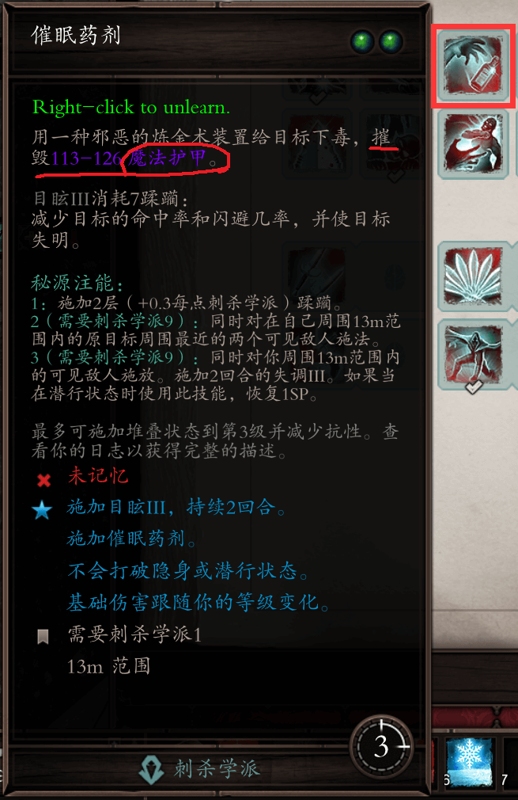
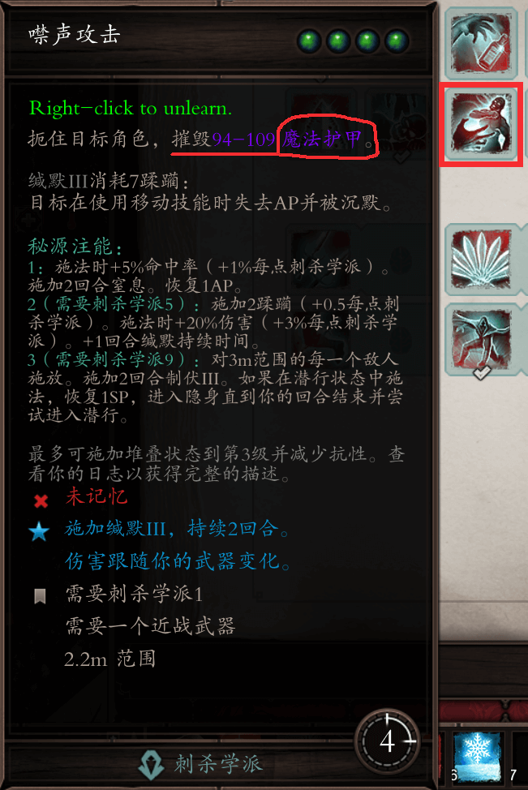
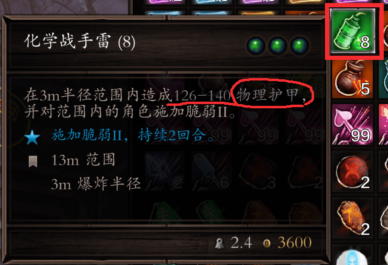
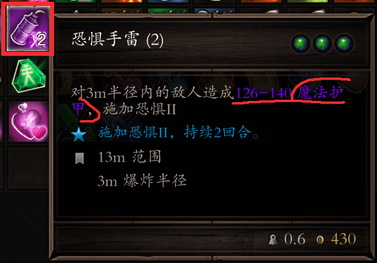

# 破甲技能

在EE的高难度下，敌人的物理抗性和元素抗性都很高，正常的技能可能无法造成很高的伤害，但是有一类技能可以无视敌人的物理抗性和元素抗性，因为这一类技能就是瞄准了护甲。比如：

- 刺杀学派的催眠药剂、噤声攻击
- 大气学派的真空之触
- 地卜学派的腐蚀之触、腐蚀喷雾
- DP版本下的化学战手雷和恐惧手雷

EE中的敌人如果没有护甲，被上debuff的时候，如果不满足3级debuff的触发条件（7层层数），将直接上2级debuff。不要小瞧2级debuff的效果，有一些效果会让游戏变得更加简单。比如说2级恐惧的效果：每回合花费1AP从敌人处逃走，这样你就可以蹭一个借机攻击。

噤声攻击更是优秀的破魔甲技能，EE把很多的刺杀技能解除了匕首限制的条件，现在双手战也可以用一些刺杀学派的技能，比如噤声攻击、穿刺。

> 真空之触、腐蚀之触、腐蚀喷雾的图片在《叠层技能》专栏。

