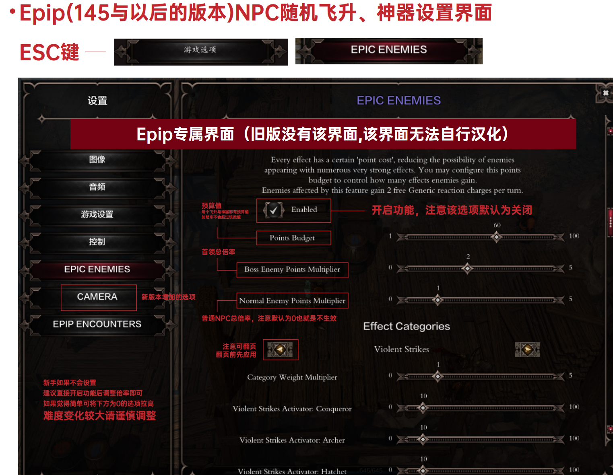

# 战斗相关

## 为什么不能召唤大魔妖

大魔妖改到飞升里去了，不点出大魔妖节点无论多少点召唤都不会出大魔妖

熵的血猿或者形的二重身内有魔妖变大魔妖的节点。

## 秘源为什么突然不回复了，有快速获得秘源/注能的方法吗

- 战斗时只有三回合自然秘源恢复，之后就只能利用其他手段恢复了，例如吃尸体，一些飞升节点(比如斯芬克斯)，原氧化(将飞升 外围点满获得，DP 删除了这个技能)，神器(比如保险库)
- 快速获得高注能或者秘源一般靠神器和飞升，比如怨恨效果，征服者第五节点，一些装备也可以刷出某个技能秘源注能+1 词条(具 体词条和部位请看群文件)

::: tip

PS：高注能效果多数很强，因此获得额外注能/秘源的神器和飞升多少带点负面效果，需要合理搭配着来使用，不然就是得不偿失

:::

## 反应动作明明达到条件了为什么没有触发

- 确认你的触发角色还有 AP 值，开场第一回合没有行动时算 0AP。只能触发免费的反应
- 一些状态下不会触发反应，比如你身上挂着三级脆弱，天文是不会触发到你身上的
- 状态被覆盖了，比如敌人被施加了三级目眩，这时候你丢一级二级目眩是无法触发目眩反应动作的

## 为什么敌人这么肉，完全是在刮痧

- 减抗，减抗，伤害低不是你的输出角色不行，而是你的减抗工具人没有发挥效果
- 敌人的蹂躏/重创到 7 层以后使用对应技能施加三级 debuff，还可以使用增强减抗比如毁灭雕像、仙火等技能进一步增加减抗效果
- 增伤(包括负增伤)EE 里都是加算，因此输出型角色再怎么堆输出也不如敌人身上挂几个三级 debuff

::: tip

PS：减抗按最高抗性计算，显示时候会被抗性上限抑制，比如流血难度某个敌人 150 全抗，但显示的是依旧是 80 全抗，因此一个 三级 debuff 还是有 100(显示 80)抗性，这时候需要多上几个或者使用增强减抗类技能，同理玩家溢出的抗性也不是没用的，毕竟 你要考虑敌人给你施加减抗

:::

## 死雾怎么秒不掉亚历山大，这玩意能正面打吗

- 死雾是一个高额的穿刺伤害（可能跟玩家等级或者属性有关，未证实），并不是强制秒杀
- 另外就算削弱了死雾，也只有死而无憾难度才秒不掉亚历山大，好家伙你怎么选的难度？？？？
- EE/EPIP 正面打基本不用考虑(DP 特别修改过所以除了死而无憾难度以外可以打正面)，另外这里不打其实并不会亏经验

## 变鸡怎么无效？

变鸡的效果改为了施加 2 层重创和蹂躏，只有对非 boss 召唤物才能变鸡

所以把变鸡的效果忽略吧，EE 中他的作用就是强上层数

## 变色龙怎么无效？

变色龙在 EE 中不再是原版无脑的隐身，战斗中使用变色龙只能强制进入潜行。

潜行只要进入敌人视野就会立即被发现，变色龙不再是保命利器，主要配合刺客处决、弓手处决等潜行增伤手段，是增加输出而非保命的技能。

## 怪物飞升怎么开启？

esc 界面内有 epip 新增的专属设置,打开后有两个倍率页面

